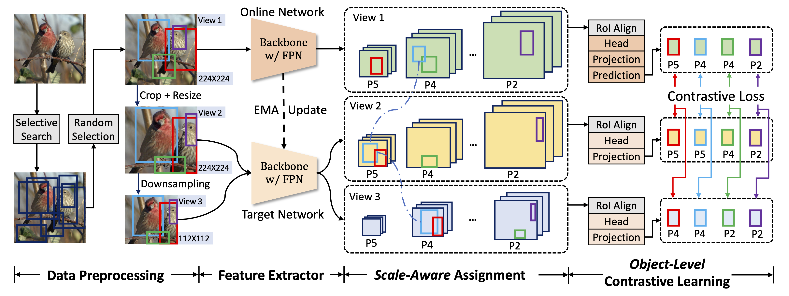

# SoCo
[NeurIPS 2021 Spotlight] [Aligning Pretraining for Detection via Object-Level Contrastive Learning](https://arxiv.org/abs/2106.02637)

By [Fangyun Wei](https://scholar.google.com/citations?user=-ncz2s8AAAAJ&hl=en)\*, [Yue Gao](https://yuegao.me)\*, [Zhirong Wu](https://scholar.google.com/citations?user=lH4zgcIAAAAJ&hl=en), [Han Hu](https://ancientmooner.github.io), [Stephen Lin](https://www.microsoft.com/en-us/research/people/stevelin/).
> \* Equal contribution.


## Introduction
Image-level contrastive representation learning has proven to be highly effective as a generic model for transfer learning. 
Such generality for transfer learning, however, sacrifices specificity if we are interested in a certain downstream task.
We argue that this could be sub-optimal and thus advocate a design principle which encourages alignment between the self-supervised pretext task and the downstream task.
In this paper, we follow this principle with a pretraining method specifically designed for the task of object detection. 
We attain alignment in the following three aspects:
1) object-level representations are introduced via selective search bounding boxes as object proposals;
2) the pretraining network architecture incorporates the same dedicated modules used in the detection pipeline (e.g. FPN);
3) the pretraining is equipped with object detection properties such as object-level translation invariance and scale invariance.
Our method, called Selective Object COntrastive learning (SoCo), achieves state-of-the-art results for transfer performance on COCO detection using a Mask R-CNN framework.


### Architecture



## Main results

### SoCo pre-trained models
| Model |     Arch     | Epochs |                       Scripts                       | Download |
|:-----:|:------------:|:------:|:---------------------------------------------------:|:--------:|
|  SoCo |  ResNet50-C4 |   100  |       [SoCo_C4_100ep](tools/SoCo_C4_100ep.sh)       |          |
|  SoCo |  ResNet50-C4 |   400  |       [SoCo_C4_400ep](tools/SoCo_C4_400ep.sh)       |          |
|  SoCo | ResNet50-FPN |   100  |      [SoCo_FPN_100ep](tools/SoCo_FPN_100ep.sh)      |          |
|  SoCo | ResNet50-FPN |   400  |      [SoCo_FPN_400ep](tools/SoCo_FPN_400ep.sh)      |          |
| SoCo* | ResNet50-FPN |   400  | [SoCo_FPN_Star_400ep](tools/SoCo_FPN_Star_400ep.sh) |          |


### Results on COCO with MaskRCNN **R50-FPN**
| Methods    | Epoch | AP<sup>bb</sup> | AP<sup>bb</sup><sub>50</sub> | AP<sup>bb</sup><sub>75</sub> | AP<sup>mk </sup> | AP<sup>mk</sup><sub>50</sub> | AP<sup>mk</sup><sub>75</sub> | Detectron2 trained |
|------------|-------|-----------------|------------------------------|-----------------------------------|--------------------|-----------------------------------|-----------------------------------|--------------------|
| Scratch    | -     | 31.0            | 49.5                         | 33.2                              | 28.5               | 46.8                              | 30.4                              |                    |
| Supervised | 90    | 38.9            | 59.6                         | 42.7                              | 35.4               | 56.5                              | 38.1                              |                    |
| SoCo       | 100   | 42.3            | 62.5                         | 46.5                              | 37.6               | 59.1                              | 40.5                              |                    |
| SoCo       | 400   | 43.0            | 63.3                         | 47.1                              | 38.2               | 60.2                              | 41.0                              |                    |
| SoCo*      | 400   | 43.2            | 63.5                         | 47.4                              | 38.4               | 60.2                              | 41.4                              |                    |


### Results on COCO with MaskRCNN **R50-C4**
| Methods    | Epoch | AP<sup>bb</sup> | AP<sup>bb</sup><sub>50</sub> | AP<sup>bb</sup><sub>75</sub> | AP<sup>mk </sup> | AP<sup>mk</sup><sub>50</sub> | AP<sup>mk</sup><sub>75</sub> | Detectron2 trained |
|------------|-------|-----------------|------------------------------|-----------------------------------|--------------------|-----------------------------------|-----------------------------------|--------------------|
| Scratch    | -     | 26.4            | 44.0                         | 27.8                              | 29.3               | 46.9                              | 30.8                              |                    |
| Supervised | 90    | 38.2            | 58.2                         | 41.2                              | 33.3               | 54.7                              | 35.2                              |                    |
| SoCo       | 100   | 40.4            | 60.4                         | 43.7                              | 34.9               | 56.8                              | 37.0                              |                    |
| SoCo       | 400   | 40.9            | 60.9                         | 44.3                              | 35.3               | 57.5                              | 37.3                              |                    |


## Get started
### Requirements
The [Dockerfile](docker/Dockerfile) is included, please refer to it.


### Prepare data with Selective Search
1. Generate Selective Search proposals
    ```python
    python selective_search/generate_imagenet_ss_proposals.py
    ```
2. Filter out not valid proposals with filter strategy
    ```python
    python selective_search/filter_ss_proposals_json.py
    ```
3. Post preprocessing for no proposals images
    ```python
    python selective_search/filter_ss_proposals_json_post_no_prop.py
    ```


### Pretrain with SoCo
> Use SoCo FPN 100 epoch as example.
```shell
bash ./tools/SoCo_FPN_100ep.sh
```


### Finetune detector
1. Copy the folder `detectron2_configs` to the root folder of `Detectron2`
2. Train the detectors with `Detectron2`


## Citation
```bib
@article{wei2021aligning,
  title={Aligning Pretraining for Detection via Object-Level Contrastive Learning},
  author={Wei, Fangyun and Gao, Yue and Wu, Zhirong and Hu, Han and Lin, Stephen},
  journal={arXiv preprint arXiv:2106.02637},
  year={2021}
}
```